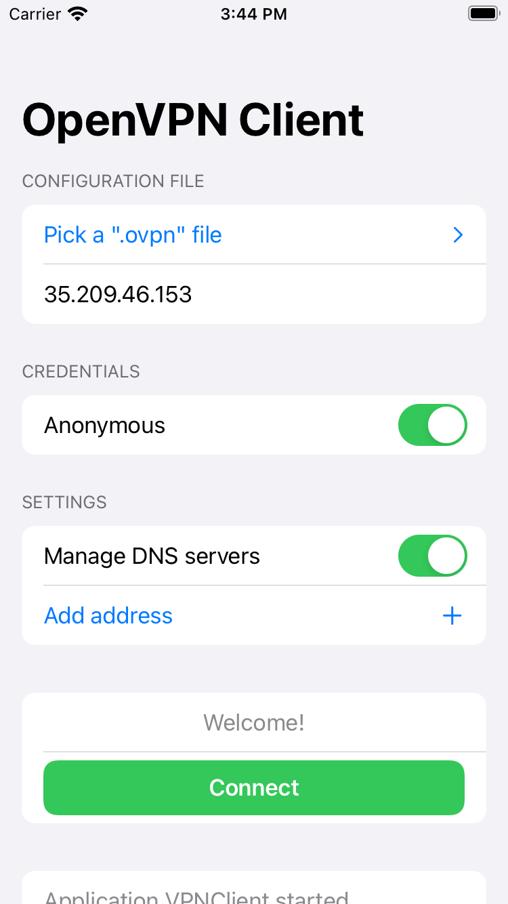

# OpenVPN Client for iOS
An OpenVPN client for iOS, based on the [OpenVPNAdapter](https://github.com/ss-abramchuk/OpenVPNAdapter) library.

## License
This project is licensed under the MIT License - see the [LICENSE](LICENSE) file for detail.
